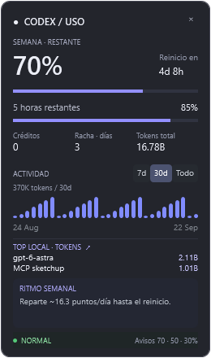

# Codex Usage Monitor

Un widget gratuito para Windows que te ayuda a no gastar tu cuota semanal de Codex de golpe.

### [⬇ Descargar para Windows · ZIP portable](https://github.com/jchaer-dot/codex-usage-monitor/releases/download/v0.5.0-beta/CodexUsageMonitor-0.5.0-win-x64.zip)

**Gratis · Código abierto · MIT · Windows 10/11 x64 · Beta 0.5.0**

[Guía de instalación](docs/INSTALACION.md) · [Guía PDF](https://github.com/jchaer-dot/codex-usage-monitor/releases/download/v0.5.0-beta/Guia-instalacion.pdf) · [Notas de versión y SHA-256](https://github.com/jchaer-dot/codex-usage-monitor/releases/tag/v0.5.0-beta) · [Reportar un problema](https://github.com/jchaer-dot/codex-usage-monitor/issues)

<p align="center">
  
</p>

<p align="center"><em>Captura de desarrollo del modo compacto; valores de ejemplo, no representa tu cuenta.</em></p>

## Tu cuota, a simple vista

¿Te quedas sin cuota antes de terminar la semana? Mantén el saldo a la vista mientras trabajas, recibe avisos al **70%, 50% y 30% restante** y consulta qué modelos y proyectos acumulan más **tokens locales**. El widget orienta; no limita tu consumo ni cambia modelos por ti.

Free, open-source Windows desktop widget for Codex usage, remaining quota alerts and locally tracked token rankings. Spanish interface. Independent community project; not affiliated with or endorsed by OpenAI.

## Descargar e instalar

1. **Descarga** [CodexUsageMonitor-0.5.0-win-x64.zip](https://github.com/jchaer-dot/codex-usage-monitor/releases/download/v0.5.0-beta/CodexUsageMonitor-0.5.0-win-x64.zip). No elijas "Source code": ese ZIP es para desarrolladores.
2. **Descomprime** con clic derecho → Extraer todo, en una carpeta permanente.
3. **Ejecuta** `CodexUsageMonitor.exe`, con Codex instalado y su sesión iniciada. No lo abras dentro del ZIP.

> **Antes de ejecutar:** esta beta no tiene firma digital. Si Windows muestra una advertencia, comprueba el origen y el SHA-256 de la [versión publicada](https://github.com/jchaer-dot/codex-usage-monitor/releases/tag/v0.5.0-beta). No desactives el antivirus. Puedes compilar el código si prefieres no usar el ejecutable distribuido.

Windows 10/11 de 64 bits. El paquete portable incluye .NET; no requiere instalarlo por separado ni permisos de administrador. Requiere el ejecutable nativo de Codex con `app-server` y acceso a los datos de uso de tu cuenta. Probado durante el desarrollo con Codex CLI 0.155.1 en Windows 11. Otras versiones y cuentas pueden no exponer las mismas métricas.

Lee la [guía completa](docs/INSTALACION.md) o descarga la [guía PDF](docs/Guia-instalacion.pdf).

## Qué incluye

- Saldo semanal restante, ventana de 5 horas cuando esté disponible y cuenta atrás del reinicio.
- Créditos y actividad de tokens cuando Codex proporciona esas métricas.
- Alertas al alcanzar o bajar de 70%, 50% y 30% **restante**. El widget debe estar abierto.
- Ranking local de tokens por modelo y proyecto: haz clic en **TOP LOCAL** para ampliarlo.
- Tamaño compacto (260 x 440) y normal (520 x 620), accesibles con clic derecho.
- Posición, tamaño y bloqueo recordados. Ventana siempre visible.
- Orientación de ritmo diario hasta el reinicio semanal.

## Qué NO mide

**Tokens locales no equivalen a créditos, dinero ni porcentaje de cuota gastado por modelo.** El ranking se calcula a partir de los registros disponibles en este equipo; no es una factura ni un desglose oficial. Puede ser incompleto y mezclar registros de cuentas usadas anteriormente. Los proyectos se agrupan por directorio de trabajo, no por identidad de proyecto de GitHub.

La guía de ritmo es orientativa: no promete ahorros ni cambia modelos automáticamente. No compra créditos ni consume resets. Un `--` significa dato no disponible, no saldo cero. La API de Codex puede cambiar; esta primera versión es **beta**.

## Privacidad

El widget ejecuta localmente `codex app-server` para consultar uso con la sesión de Codex ya existente. Codex puede comunicarse con sus servicios oficiales. El widget no tiene servidor propio ni envía tu historial a este repositorio.

Para el ranking lee archivos de `sessions` y `archived_sessions` dentro de `CODEX_HOME`, o de `.codex` en tu perfil si no está definido. Agrega fecha, modelo, directorio y tokens en memoria. Guarda preferencias y estado de alertas en `%APPDATA%\CodexUsageMonitor\settings.json`. No incluyas logs, credenciales ni nombres privados de proyectos al abrir un issue.

## Compilar y probar

En Windows con SDK .NET 8:

```powershell
dotnet build CodexUsageMonitor/CodexUsageMonitor.csproj
dotnet run --project AnalyticsChecks/AnalyticsChecks.csproj
dotnet run --project CodexUsageMonitor/CodexUsageMonitor.csproj
```

Para generar un ejecutable portable:

```powershell
dotnet publish CodexUsageMonitor/CodexUsageMonitor.csproj -c Release -r win-x64 --self-contained true -p:PublishSingleFile=true -p:IncludeNativeLibrariesForSelfExtract=true -p:DebugType=None -p:DebugSymbols=false -o dist/app
```

Las pruebas usan datos sintéticos para revisar deltas de tokens, contadores repetidos, reinicios, archivos parciales y rangos. No requieren iniciar sesión.

## Contribuir

Issues y pull requests son bienvenidos. Incluye versión de Windows, versión de Codex y pasos para reproducir; elimina información privada. Mejoras pendientes: compatibilidad con más instalaciones de Codex, accesibilidad, idioma inglés y empaquetado firmado.

Si te resulta útil, puedes darle una estrella al repositorio o compartir [este enlace](https://github.com/jchaer-dot/codex-usage-monitor). Encontrarás un [texto listo para compartir](docs/COMPARTIR.md).

Gratis, sin suscripción y con licencia [MIT](LICENSE): úsalo, modifícalo y compártelo conservando el aviso de licencia.
